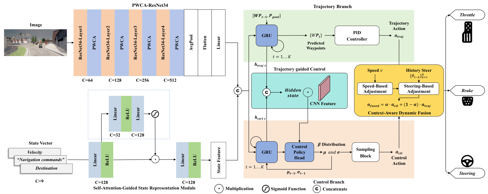
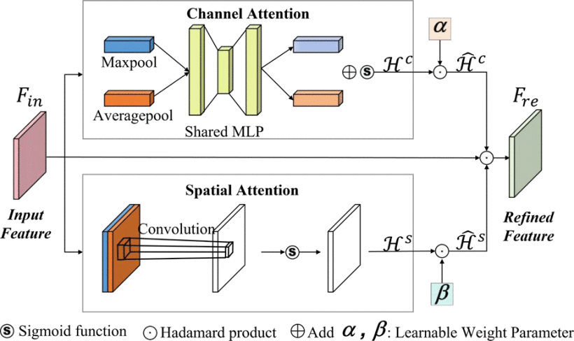
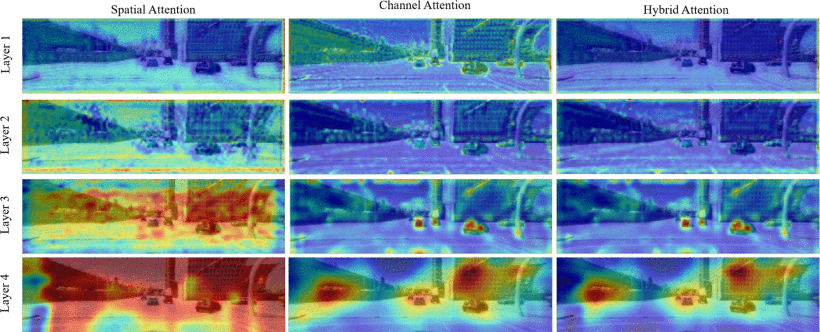
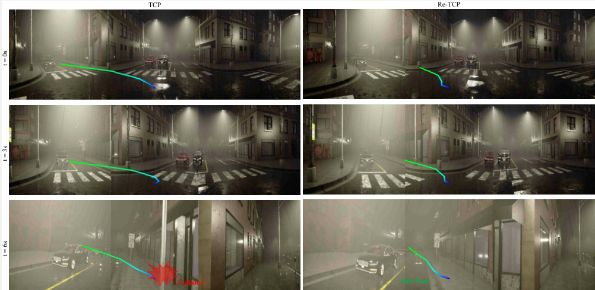
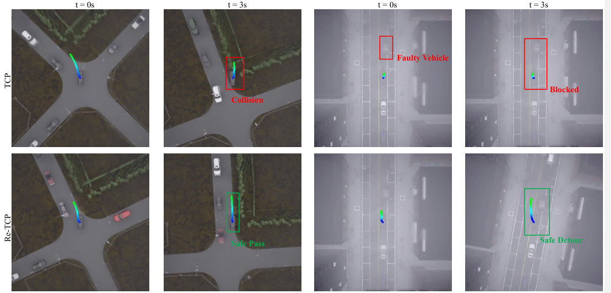

# Re-TCP: Interpretable and Dynamically Adaptive End-to-End Autonomous Driving

[](https://www.python.org/downloads/)
[](LICENSE)
[](https://carla.org/)
[](https://pytorch.org/)


This repository contains the official implementation of **Re-TCP**, an interpretable and dynamically adaptive end-to-end autonomous driving framework designed for IoT-enabled intelligent transportation systems.

---

## Overview

Autonomous driving constitutes a cornerstone safety-critical application in Internet of Things (IoT)-enabled intelligent transportation systems, where stringent requirements for **robustness in highly dynamic environments** and **interpretable decision-making** are essential for trustworthy real-world deployment.

However, existing end-to-end driving frameworks often suffer from entangled feature representations and opaque attention mechanisms, limiting their ability to reason about critical environmental cues under diverse driving scenarios.

### Key Contributions

                                               




**Re-TCP** introduces three core innovations:

1. **Parallel-Weighted Compound Attention (PWCA)** - A parallel attention architecture with learnable adaptive weighting that jointly captures spatial and channel dependencies. Unlike conventional cascaded designs, this enables disentangled yet cooperative feature selection for improved interpretability and robustness.

2. **Self-Attention-Guided State Representation Module** - Based on a linear Squeeze-and-Excitation formulation, systematically fusing vehicle dynamics, high-level navigation commands, and contextual scene representations while preserving computational efficiency.

3. **Context-Aware Dynamic Fusion** - Adaptively modulates multi-branch control outputs conditioned on vehicle speed and turning states, enabling real-time decision adaptation suitable for IoT edge devices.

---

## Results

Extensive closed-loop evaluations on the **CARLA Leaderboard** and **Bench2Drive** benchmarks demonstrate that Re-TCP significantly outperforms the baseline:







Our framework substantiates the efficacy of attention-aware perception, structured state modeling, and context-aware fusion strategies in enabling safe, interpretable, and scalable autonomous driving within IoT-enabled transportation ecosystems.

---

## Installation

### Prerequisites

- Ubuntu 18.04/20.04 (recommended)
- NVIDIA GPU with CUDA support
- Python 3.7+
- CARLA 0.9.10.1

### Step 1: Setup CARLA Simulator

```bash
mkdir carla && cd carla

# Download CARLA 0.9.10.1
wget https://carla-releases.s3.eu-west-3.amazonaws.com/Linux/CARLA_0.9.10.1.tar.gz
wget https://carla-releases.s3.eu-west-3.amazonaws.com/Linux/AdditionalMaps_0.9.10.1.tar.gz

# Extract
tar -xf CARLA_0.9.10.1.tar.gz
tar -xf AdditionalMaps_0.9.10.1.tar.gz
rm CARLA_0.9.10.1.tar.gz AdditionalMaps_0.9.10.1.tar.gz

cd ..
```

### Step 2: Clone Repository and Setup Environment

```bash
git clone https://github.com/wangdongzhuo/Re-TCP.git
cd Re-TCP

# Create conda environment
conda env create -f environment.yml --name retcp
conda activate retcp

# Set PYTHONPATH
export PYTHONPATH=$PYTHONPATH:$(pwd)
```

---

## Dataset

We provide the training dataset used in our experiments (~115GB). Download via one of the following sources:

| Source | Link | Notes |
|--------|------|-------|
| 🤗 Hugging Face | [tcp_carla_data](https://huggingface.co/datasets/craigwu/tcp_carla_data) | Split parts, combine with `cat tcp_carla_data_part_* > tcp_carla_data.zip` |
| ☁️ Google Drive | [Download](https://drive.google.com/file/d/1HZxlSZ_wUVWkNTWMXXcSQxtYdT7GogSm/view?usp=sharing) | Direct download |
| 🇨🇳 Baidu Netdisk | [Link](https://pan.baidu.com/s/11xBZwAWQ3WxQXecuuPoexQ) (Code: `8174`) | For users in China |

> **Note:** Ensure you have at least 120GB of free disk space before downloading.

---

## Training

### Configuration

Edit `TCP/config.py` to set your dataset path:

```python
# TCP/config.py
DATASET_PATH = "/path/to/your/dataset"
```

### Start Training

```bash
python TCP/train.py --gpus NUM_OF_GPUS
```

**Training Arguments:**
- `--gpus`: Number of GPUs to use (default: 1)
- `--batch_size`: Batch size per GPU (default: 48)
- `--epochs`: Number of training epochs (default: 100)
- `--lr`: Learning rate (default: 1e-4)

---

## Data Generation (Optional)

To collect new training data from CARLA:

### 1. Launch CARLA Server

```bash
cd CARLA_ROOT
./CarlaUE4.sh --world-port=2000 -RenderOffScreen
```

### 2. Configure Data Collection

Edit `leaderboard/scripts/data_collection.sh` to set:
- `CARLA_ROOT`: Path to CARLA installation
- `ROUTES`: Routes file for data collection
- `SCENARIOS`: Scenarios configuration
- `DATA_PATH`: Output directory for collected data

### 3. Run Data Collection

```bash
bash leaderboard/scripts/data_collection.sh
```

### 4. Post-Processing

After collection, filter and package the data:

```bash
python tools/filter_data.py --data_path $DATA_PATH
python tools/gen_data.py --data_path $DATA_PATH
```

---

## Evaluation

### CARLA Leaderboard Evaluation

#### 1. Launch CARLA Server

```bash
cd CARLA_ROOT
./CarlaUE4.sh --world-port=2000 -RenderOffScreen
```

#### 2. Configure Evaluation

Edit `leaderboard/scripts/run_evaluation.sh` to set:
- `CARLA_ROOT`: Path to CARLA
- `ROUTES`: Evaluation routes file
- `SCENARIOS`: Evaluation scenarios
- `CHECKPOINT`: Path to trained model checkpoint

#### 3. Run Evaluation

```bash
bash leaderboard/scripts/run_evaluation.sh
```

### Bench2Drive Evaluation

For Bench2Drive benchmark evaluation, please refer to the [Bench2Drive documentation](https://github.com/Thinklab-SJTU/Bench2Drive).

---

## Model Architecture

### Core Components

```
Re-TCP/
├── TCP/
│   ├── model.py              # Main model implementation
│   ├── resnet.py             # ResNet backbone with attention
│   ├── train.py              # Training script
│   ├── data.py               # Data loader
│   └── config.py             # Configuration
├── leaderboard/              # CARLA Leaderboard integration
├── scenario_runner/          # Scenario runner for CARLA
└── tools/                    # Utility scripts
```

### Key Modules

| Module | Description | File |
|--------|-------------|------|
| `ResNet34WithHybridAttention` | Backbone with Parallel-Weighted Compound Attention | `TCP/model.py` |
| `SEMeasurements` | Self-Attention-Guided State Representation | `TCP/model.py` |
| `PIDController` | Low-level vehicle control | `TCP/model.py` |
| `TCP` | Main end-to-end driving model | `TCP/model.py` |

---

## Visualization

We provide visualization tools for attention maps and trajectory prediction:

```bash
# Visualize attention maps
python TCP/visual_attentionmap_last.py --checkpoint $CHECKPOINT --data_path $DATA_PATH

# Visualize waypoints
python TCP/visual_waypoint.py --checkpoint $CHECKPOINT --data_path $DATA_PATH
```

---

## Acknowledgements

This project builds upon several excellent open-source repositories:

- [TCP](https://github.com/OpenDriveLab/TCP) - Trajectory-guided Control Prediction baseline
- [Transfuser](https://github.com/autonomousvision/transfuser) - Transformer-based fusion approach
- [Roach](https://github.com/zhejz/carla-roach) - RL-based expert agent
- [CARLA Leaderboard](https://github.com/carla-simulator/leaderboard) - Evaluation framework
- [Scenario Runner](https://github.com/carla-simulator/scenario_runner) - Traffic scenario generation

We thank the authors of these projects for their valuable contributions to the autonomous driving community.

---

## License

This project is licensed under the [Apache License 2.0](LICENSE).

---

## Contact

For questions or issues, please open an issue on GitHub or contact:

- Dongzhuo Wang (dzaxy@hnu.edu.cn) (https://github.com/wangdongzhuo)
- Yang Li (lyxc56@gmail.com) (https://scholar.google.cz/citations?user=jsO5m0UAAAAJ&hl=zh-CN)
---

<p align="center">
  <i>Re-TCP: Towards Safe, Interpretable, and Scalable Autonomous Driving in IoT-Enabled Transportation</i>
</p>